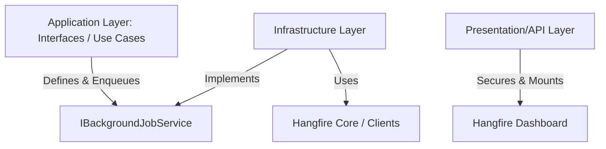

# Hangfire Background Job Service Guide

This skill guides you through implementing a generic, decoupled background job processing architecture in .NET applications using **Hangfire**. By separating the service interface from the Hangfire implementation, the application layer remains clean and mockable for testing.

---

## 1. Architectural Overview

To prevent domain and application logic from directly depending on Hangfire libraries, use the **Dependency Inversion Principle**:

1. **Application Layer**: Defines the `IBackgroundJobService` interface and any enqueued job interfaces (e.g., `ISendEmailJob`).
2. **Infrastructure Layer**: Implements `IBackgroundJobService` using Hangfire's API, manages Hangfire configuration, database storage setup, and worker server settings.
3. **Presentation/Web API Layer**: Mounts the Hangfire Dashboard and configures custom dashboard authentication/authorization filters.



---

## 2. Defining the Interface (Application Layer)

Create a generic background job service interface that exposes standard job patterns: Fire-and-Forget, Delayed, and Recurring.

```csharp
using System;
using System.Linq.Expressions;
using System.Threading.Tasks;

namespace Core.Application.Common.Interfaces;

public interface IBackgroundJobService
{
    /// <summary>
    /// Enqueues a job for immediate execution (Fire-and-Forget).
    /// </summary>
    void Enqueue<T>(Expression<Func<T, Task>> methodCall);

    /// <summary>
    /// Schedules a job to run at a specific date and time (Delayed).
    /// </summary>
    void Schedule<T>(Expression<Func<T, Task>> methodCall, DateTimeOffset enqueueAt);

    /// <summary>
    /// Schedules a job to run after a specific delay (Delayed).
    /// </summary>
    void Schedule<T>(Expression<Func<T, Task>> methodCall, TimeSpan delay);

    /// <summary>
    /// Registers or updates a recurring job (Recurring).
    /// </summary>
    void AddOrUpdate<T>(string recurringJobId, Expression<Func<T, Task>> methodCall, string cronExpression);
}
```

---

## 3. Implementing the Service (Infrastructure Layer)

Implement the interface using Hangfire's standard clients: `IBackgroundJobClient` and `IRecurringJobManager`.

```csharp
using System;
using System.Linq.Expressions;
using System.Threading.Tasks;
using Core.Application.Common.Interfaces;
using Hangfire;

namespace Core.Infrastructure.Services;

public class BackgroundJobService : IBackgroundJobService
{
    private readonly IBackgroundJobClient _backgroundJobClient;
    private readonly IRecurringJobManager _recurringJobManager;

    public BackgroundJobService(IBackgroundJobClient backgroundJobClient, IRecurringJobManager recurringJobManager)
    {
        _backgroundJobClient = backgroundJobClient;
        _recurringJobManager = recurringJobManager;
    }

    public void Enqueue<T>(Expression<Func<T, Task>> methodCall)
    {
        _backgroundJobClient.Enqueue<T>(methodCall);
    }

    public void Schedule<T>(Expression<Func<T, Task>> methodCall, DateTimeOffset enqueueAt)
    {
        _backgroundJobClient.Schedule<T>(methodCall, enqueueAt);
    }

    public void Schedule<T>(Expression<Func<T, Task>> methodCall, TimeSpan delay)
    {
        _backgroundJobClient.Schedule<T>(methodCall, delay);
    }

    public void AddOrUpdate<T>(string recurringJobId, Expression<Func<T, Task>> methodCall, string cronExpression)
    {
        _recurringJobManager.AddOrUpdate<T>(recurringJobId, methodCall, cronExpression);
    }
}
```

---

## 4. DI registration & Configuration

Register Hangfire and your wrapper service in the DI container.

### Service Registration
```csharp
services.AddScoped<IBackgroundJobService, BackgroundJobService>();
```

### Storage Configuration (e.g., SQL Server or MySQL)
Configure storage and background processing parameters in your configuration extension:

```csharp
using Hangfire;
// Import specific storage packages (e.g., Hangfire.SqlServer, Hangfire.MySql)

public static IServiceCollection AddHangfireServices(this IServiceCollection services, IConfiguration configuration)
{
    var connectionString = configuration.GetConnectionString("DefaultConnection");

    services.AddHangfire(config =>
    {
        config.SetDataCompatibilityLevel(CompatibilityLevel.Version_180)
            .UseSimpleAssemblyNameTypeSerializer()
            .UseRecommendedSerializerSettings()
            .UseStorage(new SqlServerStorage(connectionString, new SqlServerStorageOptions
            {
                CommandBatchMaxTimeout = TimeSpan.FromMinutes(5),
                SlidingInvisibilityTimeout = TimeSpan.FromMinutes(5),
                QueuePollInterval = TimeSpan.Zero,
                UseRecommendedIsolationLevel = true,
                DisableGlobalLocks = true // Improves SQL Server scalability
            }));
    });

    services.AddHangfireServer(options =>
    {
        // Adjust worker count based on resource constraints and connection limits.
        // For shared databases or tight limits, restrict workers to prevent connection pool exhaustion.
        options.WorkerCount = 2; 
        options.ServerName = "app_background_worker_1";
    });

    return services;
}
```

---

## 5. Dashboard Security (Presentation Layer)

Secure the Hangfire dashboard by implementing custom JWT validation via `IDashboardAuthorizationFilter` to prevent public access.

### Creating the Dashboard Filter
```csharp
using System;
using System.IdentityModel.Tokens.Jwt;
using System.Text;
using Hangfire.Dashboard;
using Microsoft.IdentityModel.Tokens;

public class HangfireAdminAuthorizationFilter : IDashboardAuthorizationFilter
{
    private readonly string _jwtSecret;
    private readonly string _issuer;
    private readonly string _audience;

    public HangfireAdminAuthorizationFilter(string jwtSecret, string issuer, string audience)
    {
        _jwtSecret = jwtSecret;
        _issuer = issuer;
        _audience = audience;
    }

    public bool Authorize(DashboardContext context)
    {
        var httpContext = context.GetHttpContext();

        // 1. Retrieve the token from a custom cookie or query string parameter
        if (!httpContext.Request.Cookies.TryGetValue("HangfireToken", out var token) || string.IsNullOrEmpty(token))
        {
            token = httpContext.Request.Query["token"];
        }

        if (string.IsNullOrEmpty(token)) return false;

        // 2. Validate the JWT token
        var tokenHandler = new JwtSecurityTokenHandler();
        try
        {
            var validationParameters = new TokenValidationParameters
            {
                ValidateIssuer = true,
                ValidateAudience = true,
                ValidateLifetime = true,
                ValidateIssuerSigningKey = true,
                ValidIssuer = _issuer,
                ValidAudience = _audience,
                IssuerSigningKey = new SymmetricSecurityKey(Encoding.UTF8.GetBytes(_jwtSecret)),
                ClockSkew = TimeSpan.Zero
            };

            var principal = tokenHandler.ValidateToken(token, validationParameters, out var validatedToken);

            // 3. Assert correct role permissions
            return principal.IsInRole("Admin");
        }
        catch
        {
            return false; // Authentication/Authorization failed
        }
    }
}
```

### Mapping the Middleware
Map the dashboard with the custom authorization filter in `Program.cs` or startup configuration:

```csharp
app.MapHangfireDashboard("/hangfire", new DashboardOptions
{
    Authorization = new[] { new HangfireAdminAuthorizationFilter(jwtSecret, issuer, audience) },
    IgnoreAntiforgeryToken = true
});
```

---

## 6. Best Practices

> [!IMPORTANT]
> Always enqueue job execution against **interfaces** (e.g., `_backgroundJobService.Enqueue<IJobInterface>(j => j.ExecuteAsync())`) instead of concrete classes. Hangfire resolves dependency injection correctly at runtime, allowing you to mock interfaces easily in unit tests.

> [!TIP]
> **Database Connection Safeguard**: When deploying to resource-constrained environments (such as shared hosting or database instances with low `max_connections`), set a lower `WorkerCount` in `AddHangfireServer` options (e.g., 2–5) to avoid exhausting database connections.

> [!WARNING]
> **Dashboard Cookies**: When redirecting users to the `/hangfire` dashboard, ensure the JWT token is written to the `HangfireToken` cookie with appropriate security attributes (`HttpOnly`, `Secure`, `SameSite=Strict`).
