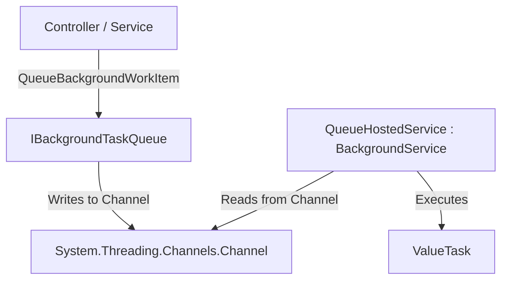

# Skill: Creating Native Background Jobs in .NET

This skill guides you through implementing a generic, thread-safe, native background job queue in .NET applications using `BackgroundService` and `System.Threading.Channels`. This is suitable when you need asynchronous background processing without external dependencies like Hangfire.

---

## 1. Architectural Overview

The native queue-based background job system consists of:
1. **`IBackgroundTaskQueue`**: Interface defining how to queue tasks.
2. **`BackgroundTaskQueue`**: Singleton implementation wrapping a `Channel<Func<CancellationToken, ValueTask>>`.
3. **`QueueHostedService`**: A hosted service inheriting from `BackgroundService` that runs in the background, reading from the channel and executing the queued tasks.



---

## 2. Implementing the Background Queue

### Define the Interface
Create `IBackgroundTaskQueue.cs` in the Application layer (or Shared/Infrastructure as appropriate):

```csharp
using System;
using System.Threading;
using System.Threading.Tasks;

namespace GreatReports.Application.Common.Interfaces;

public interface IBackgroundTaskQueue
{
    ValueTask QueueBackgroundWorkItemAsync(Func<CancellationToken, ValueTask> workItem);

    ValueTask<Func<CancellationToken, ValueTask>> DequeueAsync(CancellationToken cancellationToken);
}
```

### Implement the Queue
Create `BackgroundTaskQueue.cs` in the Infrastructure layer:

```csharp
using System;
using System.Threading;
using System.Threading.Channels;
using System.Threading.Tasks;
using GreatReports.Application.Common.Interfaces;

namespace GreatReports.Infrastructure.Services;

public class BackgroundTaskQueue : IBackgroundTaskQueue
{
    private readonly Channel<Func<CancellationToken, ValueTask>> _queue;

    public BackgroundTaskQueue(int capacity)
    {
        // Use bounded channel to prevent OutOfMemoryException under heavy loads
        var options = new BoundedChannelOptions(capacity)
        {
            FullMode = BoundedChannelFullMode.Wait
        };
        _queue = Channel.CreateBounded<Func<CancellationToken, ValueTask>>(options);
    }

    public async ValueTask QueueBackgroundWorkItemAsync(Func<CancellationToken, ValueTask> workItem)
    {
        ArgumentNullException.ThrowIfNull(workItem);
        await _queue.Writer.WriteAsync(workItem);
    }

    public async ValueTask<Func<CancellationToken, ValueTask>> DequeueAsync(CancellationToken cancellationToken)
    {
        return await _queue.Reader.ReadAsync(cancellationToken);
    }
}
```

---

## 3. Implementing the Background Worker (Hosted Service)

Create `QueueHostedService.cs` in the Infrastructure layer:

```csharp
using System;
using System.Threading;
using System.Threading.Tasks;
using GreatReports.Application.Common.Interfaces;
using Microsoft.Extensions.Hosting;
using Microsoft.Extensions.Logging;

namespace GreatReports.Infrastructure.Services;

public class QueueHostedService : BackgroundService
{
    private readonly IBackgroundTaskQueue _taskQueue;
    private readonly ILogger<QueueHostedService> _logger;

    public QueueHostedService(IBackgroundTaskQueue taskQueue, ILogger<QueueHostedService> logger)
    {
        _taskQueue = taskQueue;
        _logger = logger;
    }

    protected override async Task ExecuteAsync(CancellationToken stoppingToken)
    {
        _logger.LogInformation("QueueHostedService is starting.");

        while (!stoppingToken.IsCancellationRequested)
        {
            var workItem = await _taskQueue.DequeueAsync(stoppingToken);

            try
            {
                _logger.LogInformation("Executing background work item.");
                await workItem(stoppingToken);
            }
            catch (Exception ex)
            {
                _logger.LogError(ex, "Error occurred executing background work item.");
            }
        }

        _logger.LogInformation("QueueHostedService is stopping.");
    }
}
```

---

## 4. DI Registration

Register the queue and hosted service in `DependencyInjection.cs`:

```csharp
using GreatReports.Application.Common.Interfaces;
using GreatReports.Infrastructure.Services;
using Microsoft.Extensions.DependencyInjection;

public static IServiceCollection AddNativeBackgroundJobs(this IServiceCollection services, int queueCapacity = 100)
{
    services.AddSingleton<IBackgroundTaskQueue>(new BackgroundTaskQueue(queueCapacity));
    services.AddHostedService<QueueHostedService>();
    return services;
}
```

---

## 5. Usage Example

To enqueue a background task (e.g., sending an email):

```csharp
public class ConfirmEmailCommandHandler(
    IIdentityService identityService, 
    IBackgroundTaskQueue taskQueue,
    IEmailSender emailSender)
{
    public async Task<Result> HandleAsync(ConfirmEmailCommand command)
    {
        // Enqueue email confirmation as a background work item
        await taskQueue.QueueBackgroundWorkItemAsync(async token =>
        {
            await emailSender.SendConfirmationLinkAsync(command.Email, "...", token);
        });

        return Result.Success();
    }
}
```
