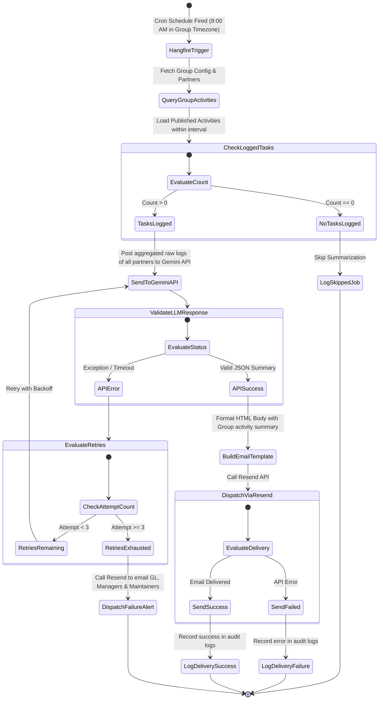
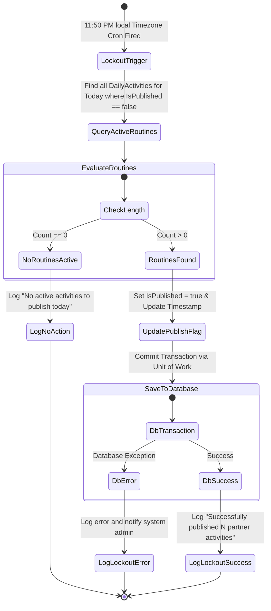

# Background Processing Workflows

This document outlines the two core background processing jobs executed by the Hangfire server:
1. **Activity Report Compilation and Email Dispatch Workflow (with Gemini Fallback Alert)**
2. **End-of-Day Daily Activity Lockout (Publishing) Workflow**

---

## 1. Activity Report Workflow

The state diagram below documents the logical flow executed by the Hangfire background worker when compiling, summarizing, and delivering periodic activities (Daily, Weekly, 10 Days, 12 Days, 15 Days, Monthly, or Specific Days of Month).

### Execution Steps

#### 1.1 Job Trigger
- Hangfire's recurring engine triggers the job (`CompileDailyActivityJob`, `CompileWeeklyActivityJob`, etc.) based on the cron schedule configured by the Group Leader, evaluated in the **Group's Timezone**.

#### 1.2 Routine Loading
- Gathers tasks logged during the specific timeframe:
  - **Daily**: Activities logged on the previous calendar day.
  - **Weekly**: Activities logged during the previous calendar week.
  - **TenDays (10)**: Activities logged from the 1st to the 10th of the current month.
  - **TwelveDays (12)**: Activities logged from the 1st to the 12th of the current month.
  - **FifteenDays (15)**: Activities logged from the 1st to the 15th of the current month.
  - **Monthly**: Activities logged during the previous calendar month.
  - **Specific Day X**: Activities logged from Day X of the previous month to Day X of the current month.
- Aggregates tasks from *all partners* in the group.

#### 1.3 Gemini LLM Summarization
- Sends the consolidated raw logs of all partners to the Gemini API. If the API fails, the worker retries up to 3 times.

#### 1.4 Fallback Alert
- If all 3 attempts fail, the worker immediately suspends delivery and calls the Resend API to send a diagnostic alert to the Group Leader, Managers, and Maintainers.

#### 1.5 Email Delivery
- Upon API success, builds the compiled HTML report and routes it via Resend to the group's configured receivers.

---

## 2. End-of-Day Daily Activity Lockout Workflow

This job triggers automatically every day at 11:50 PM in the **Group's Timezone** to mark all active daily activity tasks as **Published**, locking them against further additions or edits.

### Execution Steps

#### 2.1 Trigger
- A Hangfire recurring cron job (`PublishDailyActivitiesJob`) runs every day at 11:50 PM in the group's local timezone.

#### 2.2 Routine Locking
- Fetches all `DailyActivity` records logged today (or timezone reference date) that have `IsPublished == false`.
- Updates `IsPublished = true` on each entity record, which blocks further modifications.
- Commits changes to the database. Subsequent requests by partners to edit or add activities for that day will be rejected by domain validation checks.
