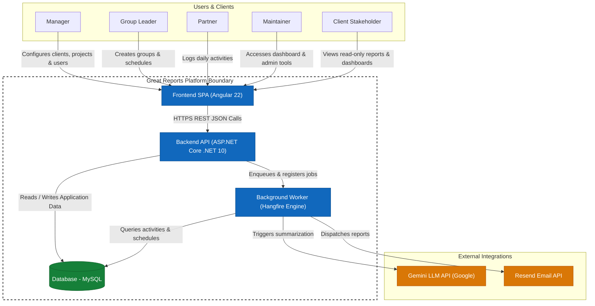

# C4 Container Diagram

The diagram below details the primary containers of the Great Reports system, their communication boundaries, and interactions with external API services.

## Container Descriptions

### 1. Frontend SPA (Angular 22)
- **Role**: Client interface providing dashboard visualizations, form registry management, activity logging pages, and read-only reports for client contacts.
- **Technologies**: TypeScript, Angular 22 (Standalone components, reactive signals), Tailwind CSS v4, and chart rendering modules.

### 2. Backend API (.NET 10)
- **Role**: Handles HTTP requests, enforces role-based access control, dispatches custom CQRS commands/queries, manages data transactions, and hosts the Hangfire management dashboard.
- **Technologies**: C#, .NET 10 Web API, ASP.NET Core Identity.

### 3. Background Worker (Hangfire Engine)
- **Role**: Process runner executing recurring and queued jobs without blocking HTTP threads. Triggers daily, weekly, 10 days, 12 days, 15 days, monthly, and specific day activity report compilations.
- **Technologies**: Hangfire Server, C#.

### 4. Database (MySQL)
- **Role**: Relational store housing application tables (Provider, Companies, Clients, Projects, activities, groups, credentials) and Hangfire job schemas.
- **Technologies**: MySQL, Entity Framework Core via `MySql.EntityFrameworkCore`.

### 5. Gemini LLM API
- **Role**: Accepts partners' raw "done" and "doing" activity logs and returns concise, structured professional reports.
- **Technologies**: External REST API, JSON.

### 6. Resend Email API
- **Role**: Sends verification codes and compiles final activity summaries to stakeholders.
- **Technologies**: External REST API.
