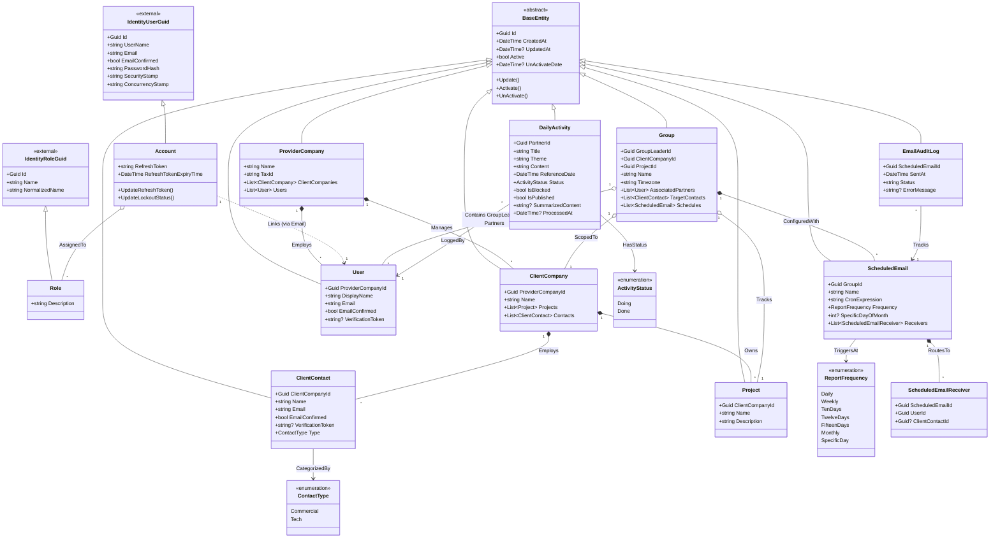

# Domain Model Class Diagram

The class diagram below outlines the core domain model representing Great Reports entities, their attributes, and relationships. It highlights the separation of `User` (Domain/Profile) and `Account` (Identity), with roles mapped directly to ASP.NET Core Identity.

## Entity Descriptions

### 1. Account (Identity)
- Extends the ASP.NET Core Identity class `IdentityUser<Guid>`. Mapped to the `"Accounts"` table. Handles passwords, token creation, lockouts, and authentication claims.

### 2. Role (Identity)
- Extends the ASP.NET Core Identity class `IdentityRole<Guid>`. Mapped to the `"Roles"` table. Handles role authorization groups (e.g. `Manager`, `Maintainer`, `GroupLeader`, `Partner`, `Client`).

### 3. User (Domain / Profile)
- Domain entity inheriting from `BaseEntity` and mapped to `"Users"`. Linked to `Account` via the unique email. Represents personal information. Does not directly manage authorization roles (these are delegated to the Identity `Account`).

### 4. DailyActivity
- Logged daily by partners. Contains individual activity titles, themes, contents, reference dates, status (`Doing`/`Done`), blockage flags (`IsBlocked`), and publishing flags (`IsPublished`). Marks tasks as draft/active during the day and locks them as Published at 11:50 PM in the group's timezone.
