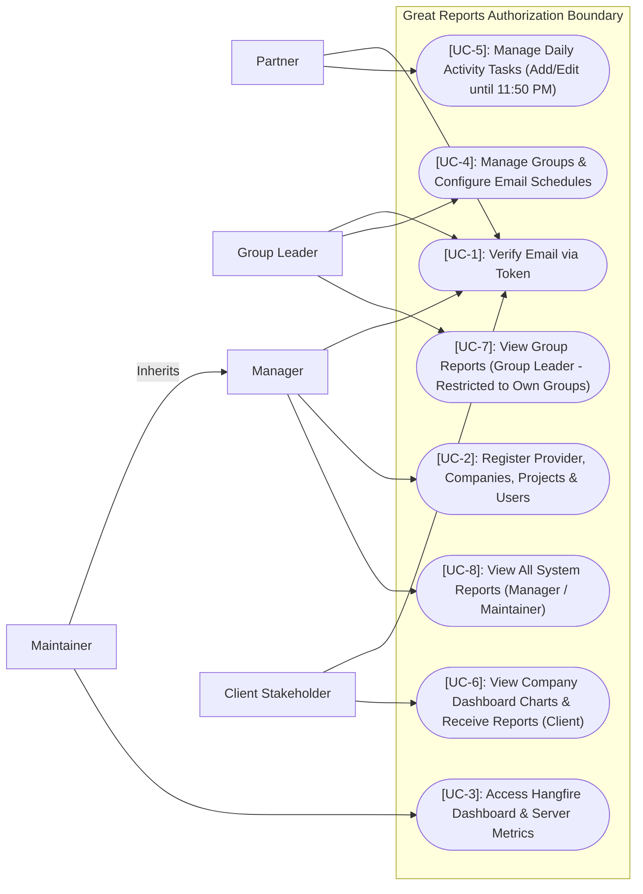

# Roles Use Case Diagram

This diagram represents the actors (system roles) and their authorization boundaries. Standard flowchart syntax is used to model use cases, visibility restrictions, and generalization flows.

## Use Case Descriptions

### [UC-1]: Verify Email via Token
- **Actors**: Partner, Group Leader, Manager, Client Stakeholder.
- **Description**: Upon account creation, the user receives a confirmation token via email and must submit it to validate their registration. No dashboard functions are accessible until verified.

### [UC-2]: Register Provider, Companies, Projects & Users
- **Actors**: Manager, Maintainer.
- **Description**: Allows administrators to register provider firms, client companies, project definitions, client contacts (commercial or tech), and system users. This action creates a `User` (domain profile) and an `Account` (identity credentials) atomically. If account creation fails, the user registry is automatically rolled back.

### [UC-3]: Access Hangfire Dashboard & Server Metrics
- **Actors**: Maintainer.
- **Description**: Authorizes access to the Hangfire administration dashboard in the Presentation layer for reviewing background queue status, job schedules, retries, and errors.

### [UC-4]: Manage Groups & Configure Email Schedules
- **Actors**: Group Leader.
- **Description**: Enables creation of partner groups, linking specific partners, client companies, projects, client contacts, and configuring custom cron-based scheduled reports (daily, weekly, 10 days, 12 days, 15 days, monthly, specific days).

### [UC-5]: Manage Daily Activity Tasks (Add/Edit until 11:50 PM)
- **Actors**: Partner.
- **Description**: Partners can add multiple task entries during the day and edit existing ones. At 11:50 PM, the system automatically marks the activities as Published (immutable). Partners can search and filter their published reports by Title, Theme, Content, and Date.

### [UC-6]: View Company Dashboard Charts & Receive Reports (Client)
- **Actors**: Client Stakeholder.
- **Description**: Permits client contacts (commercial/tech) to access read-only dashboard charts specifically filtered for their organization's projects and receive automated email activity summaries.

### [UC-7]: View Group Reports (Group Leader - Restricted to Own Groups)
- **Actors**: Group Leader.
- **Description**: Enables Group Leaders to view logs, summaries, and charts from partners assigned to the groups they created. Group Leaders cannot view reports from other groups or partners not under their supervision.

### [UC-8]: View All System Reports (Manager / Maintainer)
- **Actors**: Manager, Maintainer.
- **Description**: Grants Managers and Maintainers unrestricted read access to view all logged activities, summaries, groups, and analytics charts across the entire tenant workspace.
